# Columbia Fintech Bootcamp: Module #20 Challenge

---

Feature Summary: Joint Savings Account Smart Contract

A smart contract to automate hosting joint savings account.  Automating the creation of joint savings account using Solidity smart contract that accepts two user addresses.  The smart contract uses ether management functions to provide the features of the joint savings account. The features consist of the ability to deposit and withdraw funds from the account.

- Includes the following tasks:

    - Creates a Joint Savings Account Contract in Solidity
    - Compiles and Deploys The Contract in the JavaScript VM
    - Interacts with the Deployed Smart Contract

---

## Technologies

This projects leverages the Remix IDE which is an open source application for developing, deploying, and administering smart contracts that run in Ethereum-based blockchains. 
  
[Remix IDE](https://remix.ethereum.org/) The Native IDE for Web3 Development.

---
## Analysis

### Initial view/state of all default accounts provided by Remix
All account balances start at 100 Ether 
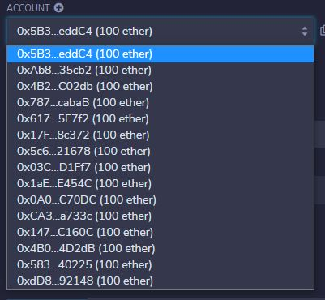 

### Initial view/state of contract (after intitial deployment)
-Empty joint account settings 
-Contract Balance = 0 
-Last to Withdraw Account = 0x000... 
-Last to Withdraw Amount = 0 
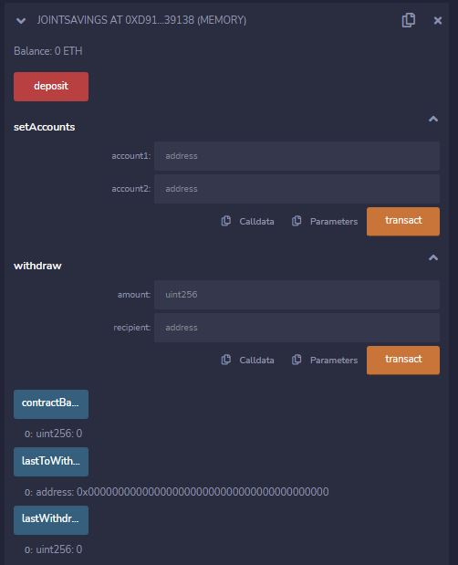 
 
-Account sender who initiated Deploy = 0x5B3... 
-Account sender balance = 100 (before deploy) - gas = 99.999... 
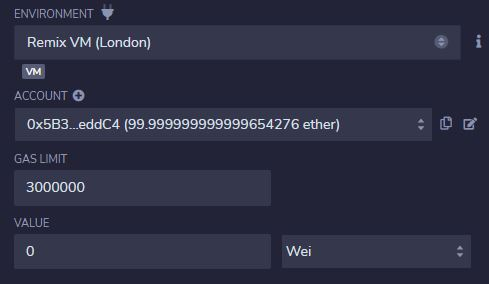 

### Add 2 joint accounts to the contract
-Account 1: 0x583... (2nd to last remix provided account) 
-Account 2: 0xdD8... (last remix provided account) 
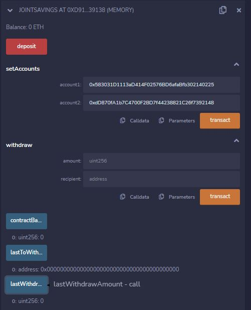 

-Account sender who initiated SetAccounts transaction = 0xAB8... 
-Account sender balance = 100 (before deploy) - gas = 99.999... 
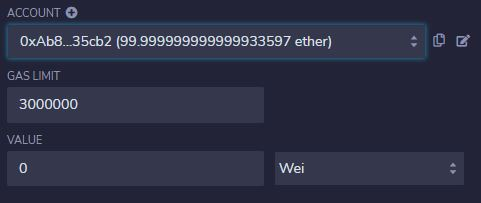 

### Deposit 1 Ether (in Wei)
-Balance: 0 ETH (before deposit) + 1000000000000000000 Wei (deposit amount) = 1 ETH 
-ContractBalance: 1000000000000000000 Wei 
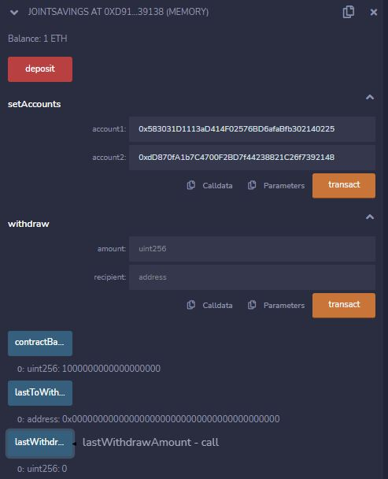 

-Account sender = 0x4B2... 
-Account sender balance = 100 (before deposit) - 1 ether (deposit amount) - gas = 98.999... 
 

### Deposit 10 Ether (in Wei)
-Balance: 1 ETH (before deposit) + 10000000000000000000 Wei (deposit amount) = 11 ETH 
-ContractBalance: 11000000000000000000 Wei 
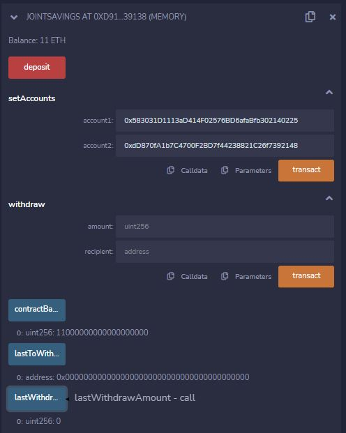 

-Account sosenderurce = 0x787... 
-Account sender balance = 100 (before deposit) - 10 ether (deposit amount) - gas = 89.999... 
 

### Deposit 5 Ether (in Ether)
-Balance: 11 ETH (before deposit) + 5 ETH (deposit amount) = 16 ETH 
-ContractBalance: 16000000000000000000 Wei 
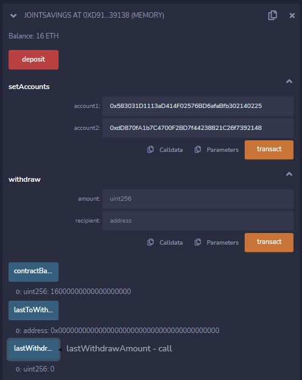 

-Account sender = 0x617... 
-Account sender balance = 100 (before deposit) - 5 ether (deposit amount) - gas = 94.999... 
 

### Withdrawal 5 Ether
-Balance: 16 ETH (before widthdrawal) - 5 ETH (withdrawal amount) = 11 ETH 
-ContractBalance: 11000000000000000000 Wei 
-Last to Withdraw Account = 0x583... (updated to joint account #1) 
-Last to Withdraw Amount = 5000000000000000000 (updated to 5 Ether) 
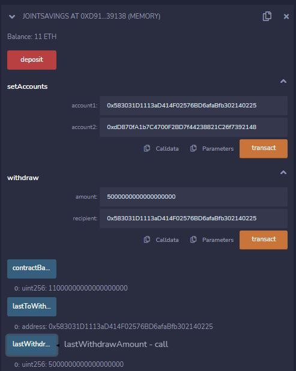 
                                           
-Account sender = 0x17F... 
-Account sender balance = 100 (before deposit) - gas = 99.999... (just gets charged gas for initiating the withrawal) 
 

-Account recepient = 0x583... (joint account #1) 
-Account recepient balance = 100 (before withdrawal) + 5 Ether(withdrawal amount) = 105 Ether 
 

### Withdrawal 10 Ether
-Balance: 11 ETH (before widthdrawal) - 10 ETH (withdrawal amount) = 1 ETH 
-ContractBalance: 1000000000000000000 Wei 
-Last to Withdraw Account = 0xdD8... (updated to joint account #2) 
-Last to Withdraw Amount = 10000000000000000000 (updated to 10 Ether) 
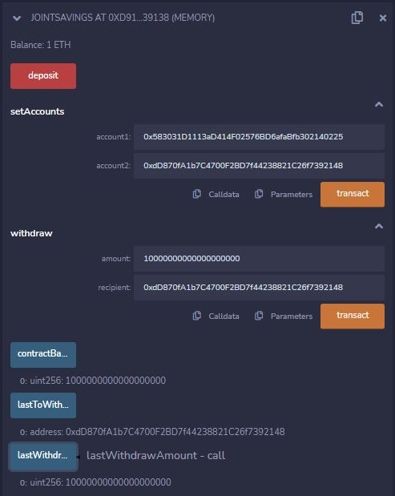 
                                           
-Account sender = 0x5c6... 
-Account sender balance = 100 (before deposit) - gas = 99.999... (just gets charged gas for initiating the withrawal) 
 

-Account recepient = 0xdD8... (joint account #2) 
-Account recepient balance = 100 (before withdrawal) + 10 Ether(withdrawal amount) = 110 Ether 
 

### Withdrawal Ether Using Unauthorized Account
-Attempt to send 1 Ether to an account address (0x4B0...) that is NOT an owner (in joint account) 
-Balance: 1 Eth (unchanged) 
-Last to Withdraw Account = 0xdD8... (Unchanged) 
-Last to Withdraw Amount = 10000000000000000000 (Unchanged) 
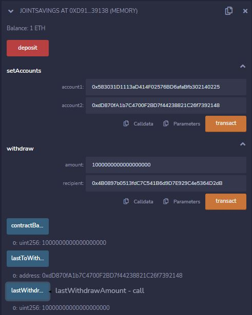 

-Shows transaction failed due to "You don't own this account!" 
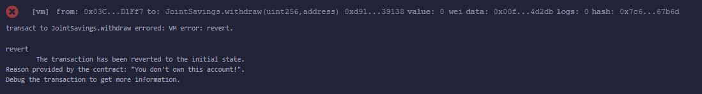 

-Account sender = 0x03C... 
-Account sender balance = 100 (before deposit) - gas = 99.999... (just gets charged gas for initiating the withrawal) 
-*** Becuase "request" caught the error, should of NOT been charged gas *** 
 

### Withdrawal Ether Without Sufficient Funds
-Attempt to send 2 Ether to an account address (0x583..., valid joint account) with insufficient funds (contract only has 1 Ether Balance) 
-Balance: 1 Eth (unchanged) 
-Last to Withdraw Account = 0xdD8... (Unchanged) 
-Last to Withdraw Amount = 10000000000000000000 (Unchanged) 
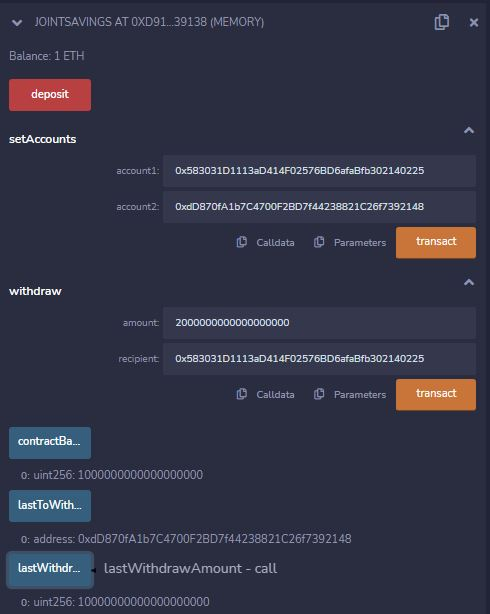 

-Shows transaction failed due to "Insufficient funds!" 
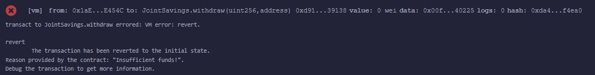 

-Account sender = 0x1aE... 
-Account sender balance = 100 (before deposit) - gas = 99.999... (just gets charged gas for initiating the withrawal) 
-*** Becuase "request" caught the error, should of NOT been charged gas *** 
 

---

## Contributors

Contributors:
- Stratis Gavnoudias
---

## License

GNU GENERAL PUBLIC LICENSE Version 3, 29 June 2007
